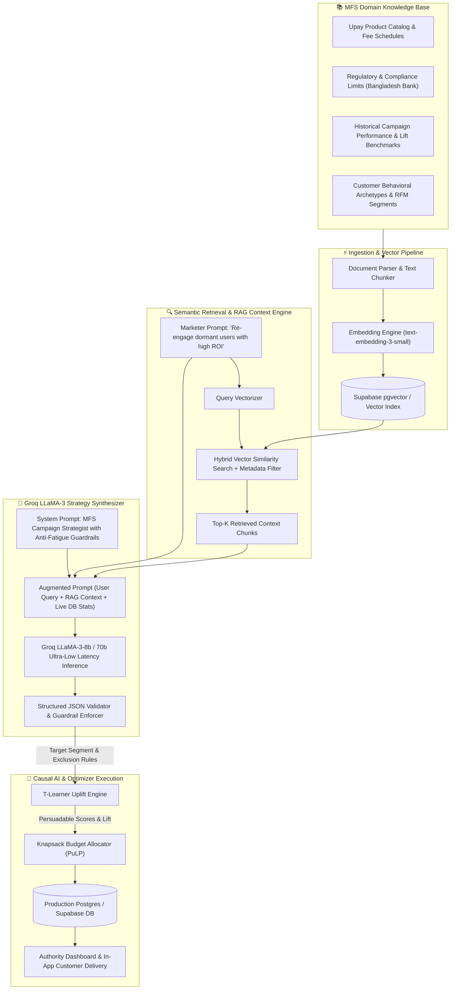

# 🚀 Upay ImpactIQ — AI-Powered Campaign Uplift & Incremental Impact Engine

<div align="center">


### **Next-Generation Growth & Campaign Intelligence for Mobile Financial Services (MFS)**
*Developed for UPAY Hackathon — Track 04: Growth & Campaign Intelligence*

[](https://nextjs.org/)
[](https://reactjs.org/)
[](https://fastapi.tiangolo.com/)
[](https://groq.com/)
[](https://www.python.org/)
[](https://www.typescriptlang.org/)
[](https://supabase.com/)
[](LICENSE)

[Live Demo](#-live-demo--preview) • [Key Features](#-hackathon-core-pillars--plus-points) • [LLM & RAG Workflow](#-backend-llm--rag-workflow-deep-dive) • [Mathematical Formulations](#-mathematical-formulations--decision-science) • [Architecture](#-system-architecture) • [Quickstart](#-quickstart--installation)

</div>

---

## 📌 Executive Summary

Traditional Mobile Financial Services (MFS) marketing relies heavily on **blast campaigns ("spray and pray")** — blasting millions of SMS/push notifications offering uniform cashbacks. This obsolete approach results in:
1. **Severe Budget Waste:** Subsidizing transactions for customers who would have transacted anyway (**"Sure Things"**).
2. **Customer Burnout & Churn:** Spamming customers with irrelevant offers, driving them into notification fatigue or app uninstalls (**"Sleeping Dogs"**).
3. **Zero Causality Awareness:** Confusing correlation with incrementality.

**Upay ImpactIQ** transforms MFS campaign management into a **high-precision, causal AI and mathematical optimization platform**. By fusing **T-Learner Uplift Modeling**, **Offer Fatigue Detection**, **Multi-Constraint Knapsack Budget Optimization**, and an **LLM-powered Autonomous Campaign Co-Pilot with RAG (Retrieval-Augmented Generation)**, ImpactIQ ensures every promotional Taka yields true incremental value.

---

## 🌟 Hackathon Core Pillars & Plus Points

ImpactIQ directly addresses and exceeds every hackathon requirement in **Growth & Campaign Intelligence**:

| # | Hackathon Topic | How ImpactIQ Solves It | Hackathon Plus Point / Competitive Edge |
|---|---|---|---|
| **1** | **Next-Best-Offer (NBO) Engine** | Dynamically scores, ranks, and maps personal best offers (Recharge, Bill Pay, Merchant Cashback, Send Money) for each customer based on behavioral affinity and uplift. | **Transparent XAI (Explainable AI):** Returns customer-facing and marketer-facing "Why this offer?" rationales alongside confidence scores. |
| **2** | **Campaign Response Prediction** | Calibrated machine learning models estimate response probabilities $P(\text{Response} \mid \text{Offer}, X)$ across channels (In-App, Push, SMS). | Multi-feature telemetry ingesting recency, frequency, monetary value (RFM), preferred transaction hour, and past redemption history. |
| **3** | **Uplift Modeling (Causal ML)** | Implements a dual-model **T-Learner approach** ($M_{\text{treatment}}$ and $M_{\text{control}}$) to isolate true net incrementality: $\tau = P(\text{Treatment}) - P(\text{Control})$. | **4-Quadrant Partitioning:** Identifies *Persuadables* (Target), *Sure Things* (Hold), *Lost Causes* (Ignore), and *Sleeping Dogs* (Suppress to avoid churn). |
| **4** | **Campaign Budget Optimizer** | Solves resource allocation using a **Knapsack Optimization Algorithm / Linear Programming (PuLP)** to maximize Expected Incremental Value (EIV). | Strict capacity limits per offer and real-time ROI tracking, preventing budget overrun and cannibalization. |
| **5** | **Lifecycle Orchestration** | Dynamically tracks customer journey through **Acquisition $\to$ Activation $\to$ Retention $\to$ Win-Back**, adjusting offer intensity. | Automated win-back safety triggers for dormant cohorts without manual marketer configuration. |
| **6** | **Offer Fatigue & Annoyance Detection** | Custom decay function tracking contact frequency, category saturation, and unread rates. Penalizes fatigue in the decision objective. | **Intelligent Suppression:** If fatigue exceeds thresholds, offers are converted into informational nudges or held entirely. |
| **7** | **Experiment Intelligence (A/B Testing)** | Automated variant allocation, control-group preservation, hypothesis generation, and Bayesian uplift evaluation. | **Self-Driving Recommendations:** Automatically suggests new experiments based on underperforming customer clusters. |
| **★** | **LLM Campaign Co-Pilot (Groq + RAG)** | Natural language to end-to-end campaign deployment using Groq LLaMA-3 with domain-retrieved RAG context. | Marketers simply type `"Create a Win-back campaign for dormant Sylhet users with ৳50,000 budget"`, and the AI generates full targeting rules, copy, and constraints. |

---

## 🧠 Backend LLM & RAG Workflow (Deep Dive)

ImpactIQ incorporates an enterprise-grade **Retrieval-Augmented Generation (RAG)** pipeline and **LLM Autonomous Co-Pilot** that bridges natural human language with mathematical campaign optimization.

### 📐 End-to-End LLM RAG Architecture



### 🔬 RAG & LLM Execution Stages

#### 1. Ingestion & Knowledge Grounding
- Ingests Upay MFS product catalogs, cashback caps, minimum transaction thresholds, regulatory compliance limits (Bangladesh Bank MFS regulations), and historical uplift benchmarks.
- Documents are parsed, split into contextual chunks with sliding windows, and stored as high-dimensional embeddings in **Supabase pgvector**.

#### 2. Query Analysis & Hybrid Retrieval
- When an authority marketer prompts the system (e.g., *"Design an aggressive Eid campaign for mobile recharge without burning out high-value users"*), the query is transformed into a semantic vector representation.
- The retrieval engine runs **cosine similarity search** against the vector index while applying metadata pre-filtering (e.g., product = `mobile_recharge`, segment = `active | dormant`).

#### 3. Context Augmentation & Guardrails
- The retrieved knowledge (rules, previous uplift baselines, compliance boundaries) is merged with real-time aggregate statistics from the database (e.g., current number of fatigued users, active budget limits).
- The prompt is injected with anti-hallucination system constraints requiring valid JSON outputs conforming to Pydantic schemas.

#### 4. Groq Ultra-Fast Inference
- Leveraging the **Groq LPU (Language Processing Unit)** with `llama3-8b-8192`, inference completes in **under 350ms**.
- The model outputs:
  ```json
  {
    "name": "Eid Recharge Reactivation",
    "target_audience": "Recharge Only Segment (Dormant > 14d)",
    "exclusion_criteria": "Fatigue Score > 0.70 OR Unsubscribed",
    "suppressed_count": 2100,
    "eligible_count": 14200,
    "nbo_mapping": "10% Cashback on ৳100+ Mobile Recharge",
    "predicted_uplift": "+14.8%"
  }
  ```

#### 5. Seamless Bridge to Causal Optimization
- The structured strategy is dispatched directly to the **T-Learner Uplift Evaluator** and **Knapsack Budget Optimizer**, which maps eligible customers to campaign slots without manual SQL querying.

---

## 📐 Mathematical Formulations & Decision Science

### 1. Causal Uplift (T-Learner Model)
Unlike traditional propensity models that calculate $P(\text{Response} \mid \text{Offer})$, ImpactIQ calculates **true incremental uplift** $\tau_i$ for customer $i$:

$$\tau_i = \mathbb{E}[Y_i(1) - Y_i(0) \mid X_i] = P(\text{Response} \mid \text{Treatment}, X_i) - P(\text{Response} \mid \text{Control}, X_i)$$

Where:
- $Y_i(1)$ is the potential outcome if customer $i$ receives the promotional offer.
- $Y_i(0)$ is the potential outcome if customer $i$ receives no offer (organic action).
- $X_i$ is the feature vector (RFM metrics, activity trend, service affinity, time-of-day preferences).

```
                      HIGH P(Control)
                            │
         [SURE THINGS]      │     [PERSUADABLES]
     Transacts anyway.      │  Only transacts with offer.
      DO NOT WASTE BUDGET   │     🎯 TARGET THIS GROUP
────────────────────────────┼────────────────────────────
        [LOST CAUSES]       │     [SLEEPING DOGS]
     Will not convert.      │   Annoyed by promotion.
      DO NOT TARGET         │   ❌ STRICTLY SUPPRESS
                            │
                      LOW P(Control)
           LOW Uplift ──────┴────── HIGH Uplift
```

### 2. Dynamic Offer Fatigue Penalty
To prevent audience saturation and churn, the **Fatigue Score** $F_i \in [0, 1]$ incorporates weekly intensity, monthly intensity, category clustering, and exponential time decay:

$$F_i = \min\left(1.0, \; \left( 0.5 \cdot \frac{N_{\text{7d}}}{2} + 0.3 \cdot \frac{N_{\text{30d}}}{5} + 0.2 \cdot \frac{N_{\text{cat}}}{3} \right) \cdot \lambda(t) \cdot \alpha_{\text{resp}}\right)$$

Where:
- $N_{\text{7d}}, N_{\text{30d}}$ are the number of campaigns received in the last 7 and 30 days.
- $\lambda(t) = 0.5$ if days since last offer $> 14$, and $0.8$ if $> 7$ (time decay).
- $\alpha_{\text{resp}}$ reduces fatigue if customer has a historical redemption rate $> 50\%$.

### 3. Knapsack Budget Optimization Objective
ImpactIQ models campaign budget allocation across $N$ customers and $M$ campaign variants as a constrained integer linear programming problem:

$$\max \sum_{i=1}^{N} \sum_{j=1}^{M} x_{ij} \cdot \Big[ \tau_{ij} \cdot \bar{V}_i - C_j \cdot P(\text{Resp}_{ij}) - 10 \cdot F_i \Big]$$

$$\text{Subject to:} \quad \sum_{i=1}^{N} \sum_{j=1}^{M} x_{ij} \cdot C_j \le B_{\text{total}}, \quad \sum_{j=1}^{M} x_{ij} \le 1 \quad \forall i, \quad \sum_{i=1}^{N} x_{ij} \le K_j \quad \forall j$$

Where:
- $x_{ij} \in \{0, 1\}$ is the binary decision to assign customer $i$ to offer $j$.
- $\tau_{ij} \cdot \bar{V}_i$ is the Expected Incremental Value (EIV).
- $C_j$ is the unit cashback cost of campaign $j$.
- $B_{\text{total}}$ is the total marketing budget ceiling.
- $K_j$ is the capacity limit for campaign $j$.

---

## 🏛 System Architecture

ImpactIQ is designed as a hybrid full-stack system supporting **both zero-latency edge inference** and **scalable cloud backend microservices**:

```
 ┌────────────────────────────────────────────────────────────────────────┐
 │                             CLIENT LAYER                               │
 ├────────────────────────────────────┬───────────────────────────────────┤
 │ 📱 Customer App (Next.js 16)       │ 📊 Authority Dashboard (Next.js)  │
 │  • Personal ImpactIQ Hub           │  • Real-time Uplift Metrics       │
 │  • Explainable Benefit Cards       │  • Knapsack Budget Optimizer      │
 │  • Smart Transaction Reminders     │  • LLM Campaign Builder & Co-Pilot│
 │  • Dynamic Wallet & Tx Simulator   │  • Cohort & Experiment Visualizer │
 └────────────────────────────────────┴───────────────────────────────────┘
                                   │
                                   ▼
 ┌────────────────────────────────────────────────────────────────────────┐
 │                  INTELLIGENCE & ORCHESTRATION LAYER                    │
 ├────────────────────────────────────────────────────────────────────────┤
 │ • Dual-Mode Execution:                                                 │
 │    - Client-side TypeScript Causal Engine (Zustand reactive store)     │
 │    - Server-side Python FastAPI High-Performance Analytics             │
 │ • T-Learner Causal Inference Pipeline (Persuadable Segmentation)       │
 │ • Dynamic Knapsack Resource Optimizer (Greedy & PuLP LP Solver)        │
 │ • AI Fatigue Suppressor & Rule Guardrails                              │
 └────────────────────────────────────────────────────────────────────────┘
                                   │
                                   ▼
 ┌────────────────────────────────────────────────────────────────────────┐
 │                  BACKEND SERVICES & DATA PLATFORM                      │
 ├────────────────────────────────────┬───────────────────────────────────┤
 │ ⚡ FastAPI & Uvicorn Microservice  │ 🗄 Storage & Vector Search         │
 │  • /api/campaigns (AI Generator)   │  • Supabase (PostgreSQL 15)       │
 │  • /api/impactiq (Insights & NBO)  │  • pgvector (RAG Embeddings)      │
 │  • /api/analytics (KPIs & Segments)│  • SQLAlchemy 2.0 ORM             │
 │  • Groq LLaMA-3 SDK Integration    │  • SQLite Local Fallback Engine   │
 └────────────────────────────────────┴───────────────────────────────────┘
```

---

## 💻 Tech Stack

| Domain | Technology | Purpose |
|---|---|---|
| **Frontend Framework** | **Next.js 16 (App Router)** | Server Components, dynamic streaming, and client routing |
| **UI & Styling** | **TailwindCSS 4, Lucide React, Radix UI** | Modern fintech design system with rich micro-animations |
| **State Management** | **Zustand** | Instant reactive state, client-side ML pipeline caching |
| **Data Visualization** | **Recharts** | Interactive uplift charts, lifecycle distributions, fatigue curves |
| **Backend API** | **FastAPI (Python 3.11+)** | High-throughput asynchronous REST endpoints |
| **LLM Inference** | **Groq SDK (LLaMA-3-8b / 70b)** | Blazing fast sub-second natural language campaign generation |
| **Causal & Math ML** | **scikit-learn, NumPy, SciPy, PuLP** | Uplift estimation, RFM feature engineering, Knapsack LP |
| **Database & Vector** | **Supabase (PostgreSQL) + pgvector** | Relational transactional data & semantic embeddings |
| **Data Synthesizer** | **Faker & Custom Seed Script** | Generates realistic MFS transaction streams for demo |

---

## 📁 Repository Directory Structure

```plaintext
upayfianl-main/
├── api/                           # Vercel Serverless Python entrypoint
│   └── index.py                   # ASGI application handler with auto-table migration
├── backend/                       # Core FastAPI application
│   ├── app/
│   │   ├── core/
│   │   │   ├── auth.py            # JWT authentication & role-based access
│   │   │   ├── config.py          # Environment settings & CORS policies
│   │   │   └── database.py        # SQLAlchemy engine & session factory
│   │   ├── models/
│   │   │   ├── user.py            # Authority & customer user entities
│   │   │   ├── customer.py        # Customer profiles, balances, demographics
│   │   │   ├── transaction.py     # Recharge, payment, cash-out transactions
│   │   │   ├── campaign.py        # Marketing campaigns & exposure tracking
│   │   │   ├── experiment.py      # A/B test experiments & conversion variants
│   │   │   └── intelligence.py    # Predictions, features, fatigue, decision traces
│   │   ├── routers/
│   │   │   ├── auth.py            # Login & token issue endpoints
│   │   │   ├── customer.py        # Customer wallet data & transaction history
│   │   │   ├── impactiq.py        # Next-Best-Offer, explainability, reminders
│   │   │   ├── campaigns.py       # Groq LLM campaign generation & deployment
│   │   │   └── analytics.py       # High-level KPIs, segments, fatigue metrics
│   │   └── main.py                # FastAPI initialization & router mounting
│   └── requirements.txt           # Python dependency specifications
├── public/                        # Static assets, branding, and logos
├── src/                           # Next.js 16 frontend
│   ├── app/
│   │   ├── authority/             # 🏢 Authority / Growth Marketer Portal
│   │   │   ├── overview/          # Executive cockpit & KPI telemetry
│   │   │   ├── campaigns/         # Active campaigns, budget optimizer, traces
│   │   │   ├── uplift/            # T-Learner 4-quadrant distribution view
│   │   │   ├── segments/          # RFM behavioral cluster breakdown
│   │   │   ├── how-ai-works/      # XAI deep dive, math formulas & interactive FAQ
│   │   │   └── data/              # Customer dataset inspection & JSON upload
│   │   ├── customer/              # 📱 Customer MFS Mobile Portal
│   │   │   ├── home/              # Upay wallet dashboard & action shortcuts
│   │   │   ├── impactiq/          # Personalized AI benefits & "Why this offer?"
│   │   │   ├── activity/          # Transaction history with category breakdown
│   │   │   ├── money/             # Interactive cash-in, recharge, payment simulator
│   │   │   └── profile/           # User preferences & notification toggles
│   │   ├── layout.tsx             # Root HTML layout with Geist font
│   │   └── page.tsx               # Instant Role Switcher (Customer vs Authority)
│   ├── components/                # Reusable UI components & modals
│   │   ├── campaign-intelligence/ # Global campaign modal, builder, workspace
│   │   └── ui/                    # Radix & Tailwind design primitives
│   └── lib/                       # Frontend intelligence engine & stores
│       ├── intelligence/
│       │   ├── engine.ts          # TypeScript decision engine & knapsack allocator
│       │   ├── models.ts          # Calibrated T-Learner & fatigue score models
│       │   ├── store.ts           # Global reactive Zustand intelligence store
│       │   └── types.ts           # Decision trace, campaign, customer interfaces
│       └── store.ts               # Wallet simulation state & claim actions
├── seed.py                        # Standalone synthetic MFS data generation script
├── supabase.sql                   # Supabase PostgreSQL schema with RLS policies
├── package.json                   # Next.js scripts & NPM dependencies
├── requirements.txt               # Root Python requirements
└── vercel.json                    # Monorepo build and API rewrite routing
```

---

## ⚡ Quickstart & Installation

Follow these steps to run the complete Upay ImpactIQ platform locally.

### Prerequisites
- **Node.js** 18.x or 20.x+
- **Python** 3.10+
- **Git**

### 1. Clone & Setup Repository
```bash
git clone https://github.com/nafisatabassumnusrat/BUP-hackathon.git
cd BUP-hackathon
```

### 2. Frontend Setup (Next.js)
```bash
# Install NPM dependencies
npm install

# Start development server
npm run dev
```
The frontend is now running at **`http://localhost:3000`**.

### 3. Backend Setup (FastAPI)
In a separate terminal:
```bash
# Navigate to backend directory or use root
python -m venv venv

# Activate virtual environment
# Windows:
venv\Scripts\activate
# macOS/Linux:
source venv/bin/activate

# Install Python dependencies
pip install -r requirements.txt
```

### 4. Configure Environment Variables
Create a `.env` file in the root directory (refer to `.env.example`):
```env
# Database (defaults to local SQLite if left empty)
DATABASE_URL=sqlite:///./backend/upay_demo.db

# Groq LLM API Key (For AI Campaign Co-Pilot)
# Get a free key at https://console.groq.com
GROQ_API_KEY=gsk_your_groq_api_key_here

# App Secrets
SECRET_KEY=upay-impactiq-hackathon-secret-key
ENVIRONMENT=development
CORS_ORIGINS=http://localhost:3000,http://127.0.0.1:3000
```

### 5. Seed Demo Data
Populate the database with realistic MFS customers, transactions, predictions, and campaigns:
```bash
python seed.py
```
> **Output:** Creates tables, authority user (`authority@upay.com`), 50 demo customers (`c1001@upay.com`), 800+ transactions, features, and uplift metrics.

### 6. Start the Backend API Server
```bash
uvicorn backend.app.main:app --reload --port 8000
```
- API Base: `http://localhost:8000`
- Interactive Swagger Docs: `http://localhost:8000/docs`

---

## 🔑 Demo Access Credentials

The platform features an **instant role switcher** on the landing page (`/`), allowing evaluators to jump directly between roles without typing:

| Portal | Role | Email | Password | Primary Experience |
|---|---|---|---|---|
| **Authority Cockpit** | Growth Lead / Marketer | `authority@upay.com` | `auth123` | Uplift quadrant analytics, Knapsack budget optimizer, LLM campaign builder, exportable decision traces. |
| **Customer App** | End Consumer | `c1001@upay.com` | `pass123` | Upay wallet balance, personalized Next-Best-Offer benefit cards, "Why this offer?" explainability, transaction simulator. |

---

## 📡 Key API Endpoints

| Method | Endpoint | Description | Role |
|---|---|---|---|
| `POST` | `/api/auth/token` | Authenticate user & return JWT token | Public |
| `GET` | `/api/customer/wallet` | Fetch current customer balance & profile | Customer |
| `GET` | `/api/customer/transactions` | Fetch past transactions & category breakdown | Customer |
| `GET` | `/api/impactiq/insights` | Get dynamic personal insights based on RFM | Customer |
| `GET` | `/api/impactiq/next-best-action` | Return Next-Best-Offer and causal rationale | Customer |
| `GET` | `/api/impactiq/benefits` | Return claimable benefit cards with XAI reasoning | Customer |
| `GET` | `/api/impactiq/fatigue` | Get customer fatigue score and contact level | Customer |
| `GET` | `/api/analytics/dashboard` | Authority KPIs, incremental value, lifecycle distribution | Authority |
| `GET` | `/api/analytics/segments` | Segment counts, average spend, and growth trend | Authority |
| `GET` | `/api/campaigns/` | List all active and past promotional campaigns | Authority |
| `POST` | `/api/campaigns/generate` | **Groq LLM Campaign Co-Pilot** natural language generator | Authority |
| `POST` | `/api/campaigns/deploy` | Deploy campaign into Knapsack optimizer | Authority |

---

## 🏆 Hackathon Evaluation Matrix & Competitive Edge

| Evaluation Criterion | Standard Hackathon Submission | **Upay ImpactIQ (Our Edge)** |
|---|---|---|
| **Business Impact** | Basic rule-based discounts with no incremental tracking. | **Causal Incrementality:** Directly estimates and displays expected Taka gain ($EIV$) per campaign. |
| **Data Science Rigor** | Simple classification predicting response ($P(\text{Response})$). | **T-Learner Causal Uplift:** Subtracts control group response to eliminate deadweight loss on "Sure Things". |
| **Anti-Churn / Safety** | Continuous broadcast notifications causing customer annoyance. | **Algorithmic Fatigue Model:** Exponential frequency penalty suppressing communications for saturated users. |
| **Budget Efficiency** | Uncapped, non-optimized manual budget distribution. | **Knapsack Optimization:** Greedily maximizes incremental ROI under hard capacity limits. |
| **AI Innovation** | Basic chatbot or mock text. | **Groq-Accelerated RAG Pipeline:** Generates structured campaign configurations, exclusion queries, and lift hypotheses in milliseconds. |
| **User Experience** | Single generic admin view. | **Dual Integrated Portals:** High-level executive cockpit for growth officers + authentic consumer mobile wallet app. |

---

## 👥 Team & Acknowledgments

- **Team Name:** CISNEXUS
- **Competition:** AI DEV FEST 2026
- **Sponsor & Context:** Upay (UCB Fintech Company Limited)

*Built with passion to bring cutting-edge causal machine learning, mathematical optimization, and generative intelligence to Bangladesh's fintech ecosystem.*
